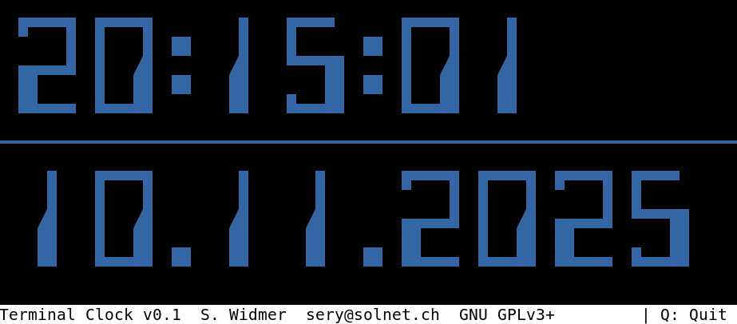
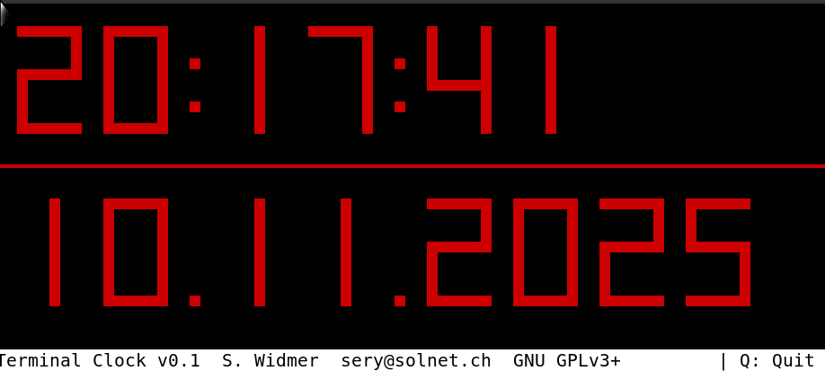
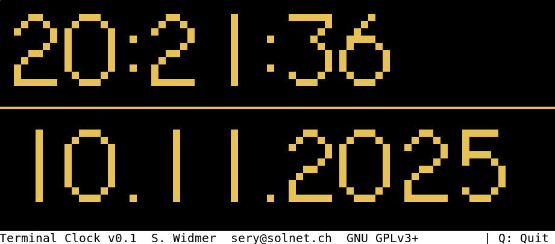

---
title: Terminal Shell Clock
author: Simon Widmer
lang: en
...

# Terminal Shell Clock

## Preface

I am coding this clock just out of fun and because I admire beautiful and funny clocks.
Instead of searching and downloading an old terminal-clock, I decided to rather create my
own one and include the date as well.




This is also proof that a fully functional program can be created with a Bash script. The advantages are obvious: a minimal installation of Linux is sufficient without having to use a bloated programming language.




## Description

Measured on several platforms, the CPU-Load should remain below 2% –
but mostly even below 1%.

Note that the label «SWISS MADE» of this clock is correct indeed –
I am living in the «clock-country» Switzerland and try to continue the art of
designing clocks. It is just that this one is made out of pure software

## Installation and Dependencies

### Linux

As this is a bash script, it is not needed to be installed. Copy it to wherever you like. However, there are a few dependencies:

- `bash`: It is a fundamental and almost universally pre-installed package on nearly all Linux distributions. Use `sudo apt install bash` if not installed.
- `tput`: The tput command is part of the ncurses-bin package (at least in Debian). Use `sudo apt install ncurses-bin` if not installed.
- `date`: In Debian and almost all other Linux distributions, the date executable (usually found at /bin/date or /usr/bin/date) is part of the coreutils package.

> After all, if you feel unsure wether you have to install those mentioned packages, most probably you don't.

### Windows

Due to the lack of a native Bash Shell, you can install [GIT Bash for Windows](https://github.com/git-for-windows/git/releases) that is intended for GIT usage and is emulating the Bash only. The clock.bash script will run nevertheless.

## Restrictions in general

1. Depending on the font and terminal shell, not all characters (Unicode!) may be displayed correctly or might look pretty.

2. Especially the Unicode triangle chars like `◢` might not be displayed correctly and might be shifted or too small in size. As terminal-font, I have tested sucessfully with `Monospace Regular 9`. As for the Terminal-Shell, I've tested with [xfce4-terminal](https://docs.xfce.org/apps/terminal/start) and [kitty](https://sw.kovidgoyal.net/kitty), native linux console and xterm so far.

3. Not every terminal shell is capable of RGB colors although most do nowadays. If using a historic one, it might be a good idea to use one of the 16 specified colors.

## Options

### --style

To give your clock a personal note and for your taste, you can choose one specific style based on an era.

Usage:

```
./clock.bash --style=50     # run clock using a style from the 50ies
./clock.bash --style=E-13B  # same as --style=50 using alias
```

Available styles:

#### `50` or `E-13B`

- Visual: MICR / bank-check style — blocky, machine-readable digits. This style is close looking to *E-13B font* that was used for [Magnetic ink character recognition code](https://en.wikipedia.org/wiki/Magnetic_ink_character_recognition), known in short as MICR code. It was introduced in 1958.
- Purpose: High-contrast, rigid digit shapes.
- Good for: Retro industrial / MICR look; terminals rendering box characters well.

#### `51` or `E-13B-simple`

- Visual: Simplified block-only variant of E-13B.
- Purpose: Same style with fewer decorative glyphs for better compatibility.
- Good for: Terminals with limited Unicode/box-drawing support.

#### `55` or `NIXIE`

- Visual: Nixie‑tube inspired glyphs with rounded/segment-like shapes.
- Purpose: Emulate vintage nixie tube numerals.
- Good for: Retro-electronic, steampunk or museum-like displays.

#### `60` or `OCR-A`

- Visual: OCR‑A (Optical Caracter Recognition) inspired segmented glyphs with distinctive gaps. This style is almost identical to [OCR-A](https://en.wikipedia.org/wiki/OCR-A). OCR-A is a font issued in 1966 and first implemented in 1968. A dedicated font was needed in the early days of computer optical character recognition, when there was a need for a font that could be recognized not only by the computers of that day, but also by humans.
- Purpose: Readable “machine/early-computer” aesthetic.
- Good for: Classic OCR look where digits are clearly 

#### `61` or `OCR-A-SIMPLE`

- Visual: Block-only simplification of OCR‑A.
- Purpose: Better terminal compatibility while keeping OCR feel.
- Good for: Terminals with limited Unicode/box-drawing support.

#### `70` or `DATA-70`

- Visual: Futuristic, angular glyphs strongly inspired by Data 70. It is intended to look like a space-age-clock. Data 70 was the rival to the also famous Westminster font.
- Purpose: Retro-futuristic / space‑age display.
- Good for: Sci‑fi themed terminals and old-console styling.

#### `71` or `DATA-70-SIMPLE`

- Visual: Simplified Data‑70 blocks.
- Purpose: Same theme with increased compatibility.
- Good for: Terminals with limited Unicode/box-drawing support.

#### `72` or `7-SEGMENT`

- Visual: Seven-segment display emulation.
- Purpose: Classic digital clock/readout appearance.
- Good for: Minimal, highly legible numeric output.

#### `78` or `VT100`

- Visual: [VT100](https://en.wikipedia.org/wiki/VT100) emulation.
- Purpose: Classic terminal appearance.
- Good for: Minimal, highly readable output.

#### `80` or `default`

- Visual: Large broad block characters; default layout.
- Purpose: Balanced option intended to render well in most terminals.
- Good for: Most users — recommended when unsure.

#### `83` or `VT220`

- Visual: [VT220](https://en.wikipedia.org/wiki/VT220) emulation.
- Purpose: Classic terminal appearance.
- Good for: Minimal, highly readable output.

#### `87` or `VT320`

- Visual: [VT320](https://en.wikipedia.org/wiki/VT320) emulation.
- Purpose: Classic terminal appearance.
- Good for: terminal shells with more than 83 chars in width

#### `90`  or `MODERN`

- Visual: Contemporary, cleaner glyphs / modernized styling. My own creation finally. 
- Purpose: A modern alternative to the retro sets.
- Good for: users preferring a sleeker look.

### --color

- Use `--color=<color>` to set the display color (default: red).
- Supported formats:
    - Colornames:
        - `black`
        - `cyan`
        - `yellow`
        - `bright`
        - `yellow`
        - `bright_green`
        - `blue`
        - `bright_magenta`
        - `bright_blue`
        - `red`
        - `bright_white`
        - `bright_black`
        - `bright_red`
        - `bright_cyan`
        - `white`
        - `green magenta`
    - Numeric: `00..15`
    - ANSI codes: `30..37` and `90..97`
    - Hex: `#RRGGBB`
    - RGB triplet R,G,B (`0..255`)

## Feature requests?

For any kind of feature you would like to see or bug reporting or thank you's:

[Email me](mailto:sery@solnet.com?subject=clock.bash%20Bugreport)

Take care! Simon
